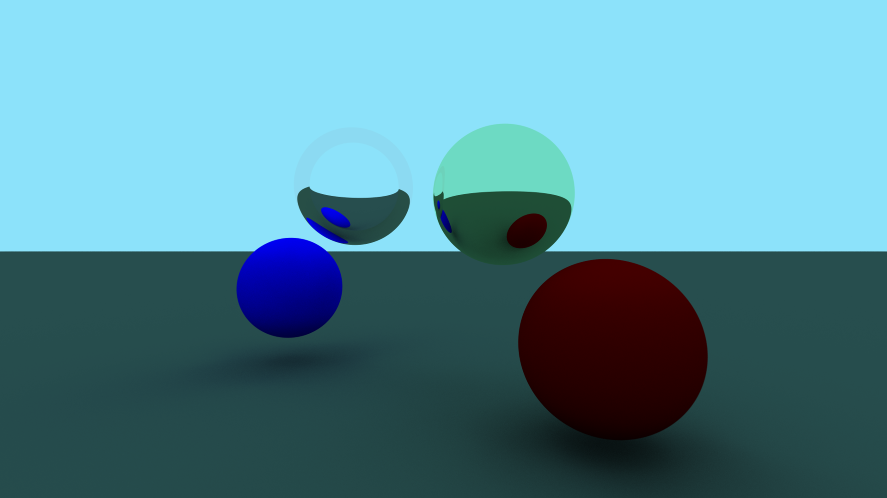

# Sperkaster

A simple raycasting engine written in [Perk](https://github.com/Alex23087/Perk), for [MellOS](https://github.com/mell-o-tron/MellOs).

It serves as a demo of the capabilities of both the language and the OS, along as a testing ground to find issues and limitations.

---

## Features

Currently supported materials:
- Solid colors
- Diffuse (Lambertian)
- Reflective (mirror)
- Refractive (glass)

## Building
Requires the [Perk compiler](https://github.com/Alex23087/Perk), specifically on the [devel](https://github.com/Alex23087/Perk/tree/devel) branch, as Sperkaster uses some features that are still experimental.

Also requires the latest version of the [MellOS](https://github.com/mell-o-tron/MellOs) kernel and build environment. The current version of MellOS already includes the latest version of Sperkaster, so there is no need to build it, unless you want to modify it.

After sorting out those requirements, you need to edit `src/includes.h` to point to your MellOS source tree, and edit `Makefile` accordingly.

Then, run `make run`.
